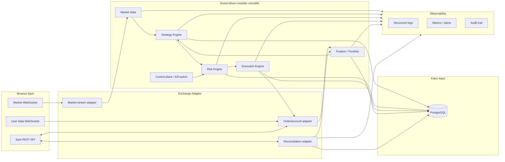

# Binance Trader Ön Analizi

**Belge durumu:** Ön analiz / karar girdisi
**Araştırma ve erişim tarihi:** 12 Eylül 2026
**Kapsam:** Binance Spot, tek hesapla başlayan ve önce paper/Testnet doğrulamasından geçen bir trader otomasyonu
**Bu belge yatırım tavsiyesi değildir.** Kârlılık, getiri veya zarar etmeme garantisi vermez; canlı işlem kararı, sermaye ve risk limitleri bu belgenin dışında ayrıca onaylanmalıdır.

## 1. Amaç, kapsam ve varsayımlar

Bu belge, Binance al-sat otomasyonu geliştirilmeden önce teknik ve operasyonel seçenekleri karşılaştırır. Amaç, uygulanabilir bir araştırma ve teslimat sırası ortaya koymak; bu turda uygulama kodu veya proje scaffold'u üretmemektir.

### Kapsam dahilinde

- Binance Spot REST, market WebSocket ve kullanıcı veri akışlarının rol ve kısıtları.
- Market Data → Strategy → Risk → Execution → Position/Portfolio → Persistence akışı.
- Benzer açık kaynak trader/quant projelerinin resmi kaynaklara dayalı karşılaştırması.
- Python merkezli stack, engine benimseme ve build-vs-adopt karar girdileri.
- PostgreSQL kavramsal veri varlıkları, olay sözleşmeleri ve audit yaklaşımı.
- Risk, güvenlik, gözlemlenebilirlik ve kurtarma kontrolleri.
- Backtest → paper/local simulation → Binance Spot Testnet → sınırlı production yol haritası.
- Varsayımlar, açık sorular, doğrulama gerektiren bulgular ve karar günlüğü.

### Kapsam dışında

- Herhangi bir uygulama kodu, SQL, migration veya bağımlılık kurulumu.
- API anahtarı, secret, özel anahtar veya canlı emir oluşturulması.
- Canlı işlem aktivasyonu ve nihai risk limitlerinin belirlenmesi.
- Kârlılık garantisi, yatırım tavsiyesi veya strateji performans vaadi.
- Git geçmişinin değiştirilmesi.

### Bağlayıcı başlangıç varsayımları

Bu varsayımlar üst seviye karar olarak bu dokümanda değiştirilmeden kullanılmıştır:

| Alan | Başlangıç kararı | Gerekçe / yeniden değerlendirme koşulu |
|---|---|---|
| Ürün kapsamı | Binance Spot, tek hesap | Kapsam ve failure domain küçük tutulur. Futures, margin ve çoklu hesap daha sonra ayrı risk analizi gerektirir. |
| İşletim sırası | Paper/local simulation → Binance Spot Testnet → sınırlı production | Emir yaşam döngüsü ve operasyonel kontroller gerçek para kullanılmadan kanıtlanır. |
| Mimari | Python tabanlı, event-driven modüler monolith | Tek hesap ve düşük/orta başlangıç hacminde düşük operasyonel yüzey; modüller daha sonra ayrıştırılabilir. |
| Exchange sınırı | Binance erişimi adapter/port arkasında | REST/WebSocket ayrıntıları strategy ve risk çekirdeğine sızmaz; ileride connector değişimi mümkün olur. |
| Strateji çekirdeği | Backtest, paper ve live arasında ortak sözleşme | Ortamlar arasında davranış farkı ve tekrar yazım azaltılır. |
| Kalıcı kayıt | PostgreSQL | Sinyal, emir, fill, PnL, risk, audit ve reconciliation geçmişi tek kalıcı kayıtta tutulur. |
| Queue/broker | Redis veya mesaj broker'ı ilk sürümde zorunlu değil | Tek process için bounded in-process queue yeterli olabilir; bağımsız ölçekleme/backpressure ölçülürse eklenir. |
| Model sırası | Açıklanabilir kurallı/istatistiksel başlangıç; ML araştırma/shadow; LLM kritik emir zinciri dışında | Denetlenebilirlik, determinism ve veri kalitesi ilk önceliktir. |

Bu varsayımlar teknik öneridir; canlı sermaye, pozisyon büyüklüğü, sembol listesi, strateji hedefi ve sayısal risk limitleri ayrıca kararlaştırılmalıdır.

## 2. Yönetici özeti ve önerilen yön

Önerilen ilk teknik yön, Binance Spot tek hesap için **Python event-driven modüler monolith** kurmaktır. Binance REST ve WebSocket bağlantıları tek bir exchange adapter sınırında toplanır; strateji ve simülasyon tarafı aynı domain olaylarını kullanır. PostgreSQL operasyonel ve denetlenebilir kayıt sistemidir. İlk model, açıklanabilir ve deterministik kurallarla oluşturulan baseline'dır; istatistiksel yöntemler bu baseline'dan sonra, klasik ML ise ancak zaman sıralı out-of-sample kanıtı varsa shadow/advisory olarak değerlendirilir. LLM doğrudan emir tarafı, fiyat, miktar veya yön kararı üretmez.

Bu seçim, hazır bir bot projesinin bütün operasyonel varsayımlarını aynen almak anlamına gelmez. Freqtrade, Hummingbot, Jesse, NautilusTrader ve LEAN; connector, order lifecycle, backtest ve risk kontrolleri için karşılaştırma ve öğrenme kaynaklarıdır. Nihai benimseme kararı lisans, canlı kullanım koşulları, backtest–live parity ve bakım riskleri doğrulandıktan sonra verilmelidir.

## 3. Binance entegrasyon ön analizi

### 3.1 REST ve WebSocket görev ayrımı

| Yüzey | Ana rol | Trader içindeki kullanım | Tasarım sonucu |
|---|---|---|---|
| Spot REST API | Emir, iptal, emir durumu, hesap/bakiye, exchange metadata ve saat sorguları | Execution emir gönderir; reconciliation açık emirleri, bakiyeleri ve order durumlarını doğrular; startup/readiness kontrolleri metadata ve saati okur | REST isteği adapter'da kalır; timeout ve imzasız/yanlış filtreli istekler fail-closed ele alınır. |
| Market WebSocket | Kline, trade, ticker ve gerekirse order-book akışının düşük gecikmeli alınması | Market Data normalizasyonu, freshness kontrolü, strategy girdisi | Bağlantı yenileme, heartbeat, stream aboneliği ve sequence gap yönetimi gerekir. |
| User Data WebSocket | Emir/bakiye güncellemelerini gerçek zamanlı bildirmek | Order state machine ve Position/Portfolio güncellemeleri | Akış kalıcı tek güven kaynağı değildir; reconnect/startup sonrası REST reconciliation zorunludur. |
| `/api/v3/time` | Binance server time | İmzalı istek öncesi saat farkı ölçümü ve clock-drift alarmı | Yerel saat farkı gözlemlenir; `recvWindow` gereksiz büyütülmez. |
| `exchangeInfo` ve filtreler | Sembol, precision, fiyat/adet/notional ve rate-limit metadata'sı | Risk ve Execution öncesi doğrulama | Metadata her ortamda runtime'da okunur/cache'lenir; sabit ve eskimiş kurallara güvenilmez. |

Binance'ın resmi Spot REST belgelerinde imzalı istekler için `timestamp` zorunludur; varsayılan `recvWindow` 5000 ms, üst sınır 60000 ms olarak belirtilir ve server time ile uyumsuzluk reddedilmeye yol açabilir. Bu nedenle saat senkronizasyonu, küçük ve gerekçeli bir pencere, ölçülen clock drift ve alarm mekanizması tasarımın parçası olmalıdır ([REST genel bilgiler ve timing security][B2]).

Fiyat, miktar ve minimum notional gibi kurallar sembol filtreleriyle doğrulanmalıdır. Küsuratı körlemesine yuvarlamak yerine filtreye uygun normalizasyon ve reddedilen emir kararının audit kaydı gerekir ([Spot filters][B3]). Filtreler, komisyonlar ve rate-limit ağırlıkları zamanla değişebileceği için deployment öncesi ve periyodik olarak resmi metadata tekrar okunmalıdır.

HTTP `5XX` veya `-1007 TIMEOUT`, emrin başarısız olduğu anlamına gelmeyebilir; işlem durumu belirsiz kalabilir. Böyle bir durumda aynı mantıksal emri körlemesine tekrar göndermek yerine `orderId`/benzersiz `newClientOrderId` üzerinden durum sorgulanmalıdır ([REST hata davranışı][B2]). Bu invariant, Execution ve reconciliation testlerinde zorunludur.

### 3.2 WebSocket bağlantı ve order-book kuralları

Resmi Spot WebSocket belgelerine göre market stream bağlantısının yaşam süresi 24 saatle sınırlıdır; sunucunun `serverShutdown` olayı gönderebildiği, yaklaşık 20 saniyelik ping'lere zamanında pong dönülmesi gerektiği ve bağlantı/mesaj limitleri bulunduğu belirtilir. Bağlantı başına gelen kontrol mesajları saniyede 5, stream sayısı 1024; IP başına bağlantı denemesi ise 5 dakikada 300 ile sınırlıdır ([WebSocket streams ve limits][B4]). Uygulama buna göre:

- 24 saat dolmadan proaktif reconnect yapmalı.
- Ping/pong'u uygulama iş kuyruğundan bağımsız, zamanında işleyebilmeli.
- Reconnect backoff ve jitter kullanmalı; reconnect storm üretmemeli.
- Abonelikleri gruplayıp kontrol mesajlarını sınırlı tutmalı.
- Reconnect sonrasında stream'leri ve user-data subscription'larını doğrulamalı.

Yerel order book kullanılacaksa resmi akışta önerilen snapshot + buffer + diff-depth sırası uygulanmalıdır: olaylar REST snapshot alınırken tamponlanır; update ID sürekliliği (`U/u`) doğrulanır; yerel son ID ile yeni olay arasında gap varsa tam resync yapılır ([Yerel order book yönetimi][B4]). Gap, eksik veri veya freshness ihlali varken strategy sinyali emir olarak ilerlememelidir.

### 3.3 Testnet gerçekliği

Binance Spot Testnet için resmi belgelerde yalnızca `/api/*` uçlarının desteklendiği, `/sapi/*` uçlarının desteklenmediği, sanal varlıkların transfer edilemediği ve ortamın yaklaşık aylık, önceden bildirilmeden sıfırlanabileceği belirtilir ([Spot Testnet genel bilgiler][B5]). Testnet verisi kalıcı üretim verisi sayılmamalıdır. Credential, symbol/filter, user-data, order lifecycle ve test fixture'ları reset sonrasında yeniden doğrulanmalıdır.

`POST /api/v3/order/test` yalnızca emir doğrulama amacı taşır; matching engine'e gerçek test emri göndermez. Gerçek emir yaşam döngüsü, timeout, user-data ve reconciliation davranışı için Spot Testnet emirleri ve resmi testnet REST kuralları ayrıca kullanılmalıdır ([Spot Testnet REST API][B6]).

### 3.4 API anahtarı bulgusu ve belirsizliği

Resmi geliştirici FAQ'sı Ed25519'ı önerilen API key türü olarak öne çıkarır ve HMAC'ın deprecated olduğunu belirtir; WebSocket API'nin bazı oturum açma/abonelik akışlarında Ed25519 gereksinimi ayrıca yazılıdır ([API key types][B7]). Bununla birlikte Binance Academy'deki resmi güvenlik yazısı RSA key pair kullanımını önerir ([RSA güvenlik rehberi][B8]). Bu iki resmi kaynak arasındaki fark nedeniyle bu ön analizde algoritma seçilmemiştir; deployment öncesi kullanılacak endpoint/connector, hesap politikası ve güncel resmi dokümanla doğrulanmalıdır.

Algoritma seçimi kesinleşene kadar aşağıdaki kontroller bağlayıcı güvenlik gereksinimi olarak ele alınmalıdır:

- Testnet ve production credential/base URL'leri tamamen ayrı tutulur.
- Trade ve user-data yetkileri mümkün olduğunca ayrı anahtarlara bölünür.
- IP allowlist uygulanır; withdrawal yetkisi açılmaz.
- Secret/private key repoya, log'a, hata mesajına veya üçüncü taraf servise yazılmaz.
- Anahtarlar secret manager veya en azından işletim ortamının güvenli secret mekanizmasıyla verilir; düzenli rotation ve şüpheli durumda revoke/rotate prosedürü bulunur.
- Production varsayılanı dry-run/read-only/fail-closed olur; canlı emir yetkisi ayrı bir aktivasyon kontrolüyle açılır.
- Anahtar güvenliği ve izinler Binance'in resmi güvenlik FAQ'sındaki kontrollerle tekrar karşılaştırılır ([API key security FAQ][B9]).

### 3.5 Resmi connector'lar

Binance'in resmi GitHub organizasyonunda güncel yönün modular/auto-generated connector'lara kaydığı gözlenmiştir. Python tarafında `binance-sdk-spot`; ayrıca JavaScript, Java, Go ve Rust connector depoları bulunmaktadır ([Python connector][B10], [JavaScript connector][B11], [Java connector][B12], [Go connector][B13], [Rust connector][B14]). Eski TypeScript connector'ı deprecated işaretlidir ([deprecated TypeScript connector][B15]).

Bu isimler ve desteklenen runtime'lar erişim tarihinde gözlenen durumu ifade eder, destek/SLA garantisi değildir. Kullanım kararı verilirse paket sürümü sabitlenmeli, connector changelog'u izlenmeli, REST/WebSocket davranışı adapter contract testleriyle doğrulanmalı ve resmi depodaki değişiklikler kontrollü alınmalıdır.

## 4. Önerilen mimari ve olay akışı

Bu diyagram bir uygulama kodu değil, sınırların ve veri akışının kavramsal görünümüdür. Modüler monolith içinde bile aşağıdaki kurallar korunmalıdır:

1. **Exchange adapter** dış dünya protokolünü domain olaylarına ve command'lerine dönüştürür; strategy doğrudan Binance client çağırmaz.
2. **Market Data** gelen veriyi normalize eder, sıra/freshness ve bağlantı durumunu yayınlar.
3. **Strategy** yalnızca gözlemlenebilir girdilerden version'lı ve açıklamalı signal üretir; miktar/yönün risk sınırlarını aşmasına karar vermez.
4. **Risk** signal'ı emir niyetine çevirmeden önce veri tazeliği, sembol filtreleri, bakiye, açık emir, exposure, rate-limit bütçesi ve kill switch durumunu kontrol eder.
5. **Execution** onaylı emir niyetini idempotent şekilde REST çağrısına çevirir; emir yaşam döngüsünü ve belirsiz durumları yönetir.
6. **Position/Portfolio** fill ve bakiye olaylarından pozisyon, maliyet tabanı, gerçekleşmiş/gerçekleşmemiş PnL ve exposure görünümünü üretir.
7. **PostgreSQL** kararların ve durum geçişlerinin denetlenebilir kaydını tutar; Binance hesabının canlı gerçeği ise reconciliation ile karşılaştırılır.
8. **Observability** her olayın correlation ID, strategy version, environment ve sonuç bilgisini taşır; secret veya gereksiz kişisel veri taşımaz.

### 4.1 Bileşen sorumlulukları ve temel olaylar

| Bileşen | Sorumluluklar | Girdi → çıktı | Kritik invariant |
|---|---|---|---|
| Market Data | Market WebSocket bağlantısı, normalize etme, event-time/receive-time ayrımı, freshness, heartbeat ve sequence kontrolü | Raw stream → `MarketTick`, `Candle`, `Trade`, `OrderBookSnapshot`, `OrderBookDelta`, `DataHealthChanged` | Gap, stale data veya belirsiz bağlantı halinde güvenli duruş; order book gap sonrası snapshot+replay. |
| Strategy Engine | Ortak backtest/paper/live strateji arayüzü, signal üretimi, strategy/version/reason kaydı | Market/portfolio event'leri → `SignalGenerated` | Exchange çağrısı yok; deterministic clock ve aynı girdide tekrarlanabilir çıktı. |
| Risk Engine | Exposure/bakiye, sembol filtreleri, fiyat/adet/notional, stale data, rate-limit bütçesi, günlük/stratejiye özgü limitler ve kill switch kontrolü | Signal + Portfolio + metadata + health → `RiskApproved` veya `RiskRejected` | Eksik veri/limit/metadata durumunda fail-closed; risk kararı audit edilir. Sayısal limitler ayrıca onaylanır. |
| Execution Engine | Client order ID üretimi, REST submit/cancel/query, timeout/unknown status, partial fill, retry politikası ve order state machine | `RiskApproved` → `OrderIntent`, `OrderSubmitted`, `OrderStatusChanged`, `FillReceived` | Timeout/5XX/-1007 sonrası kör retry yok; önce order status doğrulanır; duplicate order önlenir. |
| Position / Portfolio | Fill ve bakiye muhasebesi, average price, fees, realized/unrealized PnL, exposure ve reconciliation farkı | Order/fill/account/reconciliation → `PositionChanged`, `PnLUpdated`, `ReconciliationResult` | Restart ve duplicate/out-of-order event sonrası aynı sonuca ulaşır; exchange ile fark görünür kalır. |
| Persistence | Domain kararları, geçişler, metadata snapshot'ları ve audit kayıtları | Tüm kritik olaylar → PostgreSQL | Transaction/idempotency anahtarları; write failure emir güvenliğiyle birlikte ele alınır. |
| Observability | Structured log, metric, alert, trace/correlation; replay ve incident inceleme desteği | Bütün bileşenlerden telemetry → dashboard/alert/audit | Secret masking, saat/latency/freshness/connection/rate-limit/order mismatch görünürlüğü. |
| Control plane | Dry-run/live modu, kill switch, pause/resume, config ve activation kayıtları | Operatör/health/risk event'i → `TradingPaused`, `KillSwitchActivated` | Kill switch güvenli ve fail-closed; aktivasyon kimliği/zamanı/açıklaması audit'e yazılır. |

### 4.2 Olay sözleşmeleri

Olaylar implementasyon ayrıntısından bağımsız olarak en az şu kavramsal alanları taşımalıdır: `event_id`, `event_type`, `schema_version`, `event_time`, `received_at`, `source`, `environment`, `correlation_id`, `causation_id` ve ilgili domain kimliği. Emir ve fill olaylarında exchange sembolü, exchange order ID, benzersiz client order ID ve state transition zamanı ayrıca tutulmalıdır.

Önerilen olay dizisi:

1. `MarketDataReceived` / `OrderBookSynchronized`
2. `SignalGenerated`
3. `RiskDecisionMade`
4. `OrderIntentCreated`
5. `OrderSubmitted` veya `OrderRejected`
6. `OrderStatusChanged` / `FillReceived`
7. `PositionChanged` / `PnLUpdated`
8. `ReconciliationCompleted` veya `ReconciliationDiscrepancyDetected`
9. Gerekirse `TradingPaused` / `KillSwitchActivated`

Her kritik olayın nedeni ve önceki olayla ilişkisi saklanmalıdır. Böylece “neden bu emir gönderildi?”, “risk hangi veriye göre onayladı?” ve “fill sonrası pozisyon nasıl değişti?” soruları tekil log satırı aramadan cevaplanabilir.

## 5. Exchange adapter ve emir yaşam döngüsü

Adapter aşağıdaki dış arayüzleri tek bir iç sözleşmede toplamalıdır:

- `get_server_time`, `get_exchange_info`, `get_account`, `get_open_orders`, `get_order`.
- `submit_order`, `cancel_order`, `cancel_all` veya ürün kapsamına alınan güvenli alt küme.
- Market stream ve user-data stream başlatma, durdurma, reconnect, subscription ve health sinyali.
- Binance hata kodlarını, HTTP durumlarını ve stream mesajlarını domain seviyesinde sınıflandırma.

### Normal emir akışı

1. Strategy, strategy version ve gerekçesi olan bir signal üretir.
2. Risk, signal'ı güncel market health, exchangeInfo filtre snapshot'ı, bakiye ve açık pozisyonla değerlendirir.
3. Onaylanan signal, tekil bir logical order intent ve unique `newClientOrderId` alır.
4. Execution, intent'in bu ortamda canlı emir yetkisine sahip olup olmadığını kontrol eder; paper modunda simülatöre, Testnet/production modunda adapter'a yönlendirir.
5. REST cevabı, user-data olayı ve periyodik order query aynı state machine'e beslenir; duplicate olaylar dedupe edilir.
6. Fill'ler Position/Portfolio'ya gider; order, fill, fee, PnL ve audit kayıtları PostgreSQL'e yazılır.
7. Reconciliation, beklenen ve Binance'den okunan açık emir/bakiye/pozisyon görünümünü karşılaştırır.

### Belirsiz order durumu

Aşağıdaki durumlarda emir “başarısız” varsayılmamalıdır:

- HTTP `5XX`.
- `-1007 TIMEOUT`.
- Bağlantı kopması, process restart veya user-data akışında boşluk.
- REST cevabı alınmadan client timeout.

İşlem sırası: yeni emir göndermeyi durdur veya ilgili intent'i `UNKNOWN` olarak işaretle; `orderId`/`newClientOrderId` ile status sorgula; user-data ve REST sonuçlarını aynı correlation ID altında birleştir; yalnızca kesin state'e ulaşıldığında yeniden işlem kararı ver. Tekrar gönderme kararı hiçbir zaman ağ hatasının kendisinden türetilmemelidir.

### Partial fill

Partial fill ayrı bir terminal olmayan durumdur. Kalan miktar, gerçekleşen ortalama fiyat, ücret ve stratejinin iptal/yeniden fiyatlama politikasına göre ayrı kaydedilir. Bu politika tanımlanmadan “emir tamamlandı” kabulü yapılmamalıdır. Kısmi dolum ve cancel/replace davranışı Testnet geçiş kapısının zorunlu senaryolarındandır.

## 6. Teknoloji ve engine seçenekleri

### 6.1 Python merkezli önerilen stack

Sürüm numaraları bu ön analizde sabitlenmemiştir; uygulama aşamasında desteklenen Python runtime'ı, connector paketi ve veritabanı sürümleri ayrı bir uyumluluk matrisiyle pinlenmelidir.

| Katman | Öneri | Not |
|---|---|---|
| Çekirdek runtime | Python, `asyncio` tabanlı event loop | REST, WebSocket, bounded in-process queue ve deterministic clock sınırları açık tutulur. CPU-ağır araştırma işleri canlı event loop'tan ayrılır. |
| Exchange erişimi | Resmi Binance Python connector veya kontrollü REST/WebSocket client, mutlaka exchange adapter arkasında | Resmi connector'ların paket ve API durumu değişebilir; contract test ve changelog takibi gerekir. |
| Domain modelleri | Tipli, schema-version'lı Python domain modelleri; dataclass/Pydantic benzeri doğrulama seçeneği | Olayların JSON/DB temsili ile exchange payload'ı birbirine bağlanmaz. |
| Event dispatch | Başlangıçta bounded in-process queue ve açık backpressure | Tek process/tek hesap için Redis veya broker başlangıç şartı değildir. Kuyruk dolarsa yeni risk/emir akışı güvenli şekilde durur. |
| Kalıcılık | PostgreSQL; connection pool, transaction ve idempotency kayıtları | Signal/order/fill/PnL/risk/audit/reconciliation geçmişi için plain PostgreSQL ile başlanabilir. |
| Tarihsel veri | PostgreSQL'de kontrollü candle/trade verisi; yüksek hacimli raw depth için ileride Parquet/object storage | Operasyonel DB'yi bütün ham depth akışıyla sınırsız büyütmemek gerekir. |
| Test | Unit, contract, property-based, deterministic replay, integration ve failure-injection testleri | Özellikle timeout, duplicate, gap, restart, partial fill ve reconciliation testleri önce gelir. |
| Observability | Structured logging, metrics/alerts; ihtiyaçta OpenTelemetry/Prometheus uyumlu çıkış | Telemetry event correlation ve secret masking ile tasarlanır. |
| Dağıtım | Tek process veya sınırlı worker'lı container/VM; runbook ve fail-closed startup | Kubernetes, microservice ve broker ölçeği kanıtlanmadıkça ilk ön koşul değildir. |
| Secret yönetimi | Host/cloud secret manager veya güvenli runtime injection | Secret dosyası repoya veya log'a yazılmaz; testnet/production ayrıdır. |

Bu stackin amacı “en fazla teknoloji” değil, kararların test edilebilir bir çekirdek etrafında toplanmasıdır. ORM, web paneli, cache, scheduler veya broker eklemek ancak ölçülmüş ihtiyaca cevap vermelidir.

### 6.2 Alternatif karar matrisi

Değerlendirme: **Yüksek** başlangıç uygunluğu olumlu; **Orta** koşullu; **Düşük** ilk hedefle uyumsuz veya ek riskli anlamına gelir. Lisans bilgileri erişim tarihinde resmi repo dosyalarından gözlenen bilgilerdir; hukuki görüş değildir.

| Seçenek | Lisans | Binance / engine uygunluğu | Güçlü taraf | Sınırlama / karar notu | İlk öneri |
|---|---|---|---|---|---|
| Python özel modüler monolith | Yeni kodun lisansı ayrıca seçilir | Spot tek hesap ve adapter mimarisiyle yüksek | Kapsam, audit ve risk invariant'ları doğrudan kontrol edilir; backtest/paper/live ortak çekirdek kurulabilir | Order lifecycle, reconciliation ve gerçekçi simulator sıfırdan doğrulanmalıdır | **Başlangıç için tercih** |
| Freqtrade | GPLv3 | Binance Spot/Futures, candle/backtest ve dry-run akışında yüksek | Python ile hızlı başlangıç, hazır korumalar ve geniş kullanıcı ekosistemi | GPLv3 uyumluluğu, candle tabanlı backtest varsayımları ve özel event-driven engine uyarlaması incelenmelidir | Candle ağırlıklı MVP için karşılaştırma; doğrudan benimseme kararı ayrıca |
| Hummingbot | Apache-2.0 | Binance connector; order-book, market making ve multi-connector için yüksek | Connector, Strategy V2 Controller/Executor ve order-book yaklaşımı | Operasyonel yüzey daha karmaşık; resmi Quants Lab bakım durumu güvenilecek tek kaynak sayılmamalı | Market making/order-book ağırlığı oluşursa güçlü aday |
| Jesse | MIT çekirdek | Binance Spot ve diğer modlarda backtest/research yüksek | Python araştırma API'si, PostgreSQL/Redis, multi-timeframe, partial fill ve metrikler | Resmi canlı/paper akışı lisans anahtarı isteyen plugin'e bağlı; GitHub release görünürlüğü ile changelog durumu farklı olabilir | Research/backtest referansı; canlı lisans incelemesi şart |
| NautilusTrader | LGPL-3.0 | Binance Spot için event-driven, REST+WebSocket, Demo/Testnet/Live yüksek | Ortak research/backtest/live akışı, deterministik engine, Risk/Execution ve reconciliation kapsamı | Rust/PyO3/Tokio karmaşıklığı; v2 release candidate ve API kırılma riski; custom RiskEngine extension ihtiyacı ayrıca doğrulanmalı | Uzun vadeli engine adayı; v2 stabilitesi ve lisans incelemesi şart |
| LEAN + Binance brokerage | Apache-2.0 | Genel quant engine, Binance Spot ve demo/paper/live orta-yüksek | Olgun C# engine, Python/C# algoritmalar, fee/risk/buying power modeli | Crypto-first değil; Binance canlı CLI akışı QuantConnect hesabı/organizasyon aboneliğine bağlanıyor; brokerage backtest modeli slippage'i tam modellemeyebilir | C#/genel quant gereksinimi varsa değerlendirme |

### 6.3 Build-vs-adopt sonucu

- **Hazır bot benimseme:** Candle tabanlı Binance stratejileri için Freqtrade; order-book/market making için Hummingbot; Python research için Jesse; yüksek event parity için NautilusTrader; genel multi-asset quant için LEAN uygun referanslardır.
- **Hazır projeden öğrenme:** Connector sınırı, user-data lifecycle, idempotency, reconciliation, partial fill, fee/slippage ve dry-run ayrımı incelenmelidir.
- **Özel modüler çekirdek:** PostgreSQL üzerinde karar/audit geçmişi, kuruma özgü risk kuralları, tek hesapta kontrollü kapsam veya lisans kısıtlarından kaçınma öncelikliyse anlamlıdır.
- **Sıfırdan yapmanın en riskli alanları:** order lifecycle, unknown order status, exchange reconciliation ve backtest matching gerçeğe uygunluğudur. İlk sprintler bu riskleri kanıtlamaya ayrılmalıdır.

Nihai framework seçimi bu belgenin bağlayıcı bir sonucu değildir. Jesse canlı plugin'i, LEAN Binance live koşulları veya Nautilus v2 API'si ürün kapsamına alınırsa lisans, maliyet ve bakım incelemesi yeniden yapılmalıdır.

## 7. Strateji ve model seçimi

### 7.1 Model olgunluk matrisi

| Model | Veri ihtiyacı | Açıklanabilirlik | Leakage/overfit riski | İlk üretim rolü |
|---|---|---|---|---|
| Kurallı / deterministik | Düşük–orta | Yüksek | Orta; parametre çoğaltma riski | MVP ana strategy baseline |
| İstatistiksel | Orta | Orta–yüksek | Rejim, stationarity ve selection bias riski | Kurallı baseline sonrası kontrollü genişleme |
| Klasik ML | Orta–yüksek; etiketli ve point-in-time veri | Orta | Feature/label leakage ve tuning overfit | Shadow/advisory; baseline'ı out-of-sample aşarsa yeniden değerlendirme |
| Deep learning | Yüksek hacimli, kaliteli ve uzun tarihçe | Düşük–orta | Çok yüksek; rejim değişimi ve veri kalitesi | Araştırma hattı |
| LLM | Nicel emir kararı için uygunluğu ve kalibrasyonu kanıtlanmamış | Düşük / determinism sınırlı | Model/prompt drift, hallucination ve kontrol edilemezlik | Raporlama, açıklama, araştırma hipotezi veya operasyon asistanı |

Bağlayıcı karar sırası:

1. Sağlam muhasebe ve açıklanabilir kurallı baseline.
2. İstatistiksel sinyaller; rejim, stationarity ve walk-forward kanıtı.
3. Klasik ML; yalnızca baseline'a göre tekrarlanabilir out-of-sample iyileşme gösterirse shadow/advisory.
4. Deep learning; veri hacmi, kalite ve leakage kontrolü ispatlanırsa araştırma.
5. LLM; log açıklama, raporlama veya kontrollü operasyon desteği; **doğrudan order side/price/quantity karar zincirinin dışında**.

LLM ileride incelense bile schema-constrained çıktı, insan/onay katmanı veya önceden tanımlı otomatik politika, shadow mode, deterministik fallback, gecikme/maliyet ölçümü ve rule baseline karşılaştırması gerekir. Bu ön analiz, LLM'yi kritik emir bileşeni olarak önermemektedir.

### 7.2 Bütün modeller için validasyon

- Zaman sıralı train/validation/test ayrımı; rastgele karıştırma yok.
- Walk-forward evaluation ve point-in-time feature üretimi.
- Ücret, spread, slippage, latency ve partial fill sonrası sonuç.
- Birden fazla sembol ve farklı piyasa rejimleri.
- Ablation, sensitivity ve parametre kararlılığı testleri.
- Aynı input/clock/seed ile deterministic replay.
- Backtest → paper → Testnet farklarının signal, order ve PnL bazında karşılaştırılması.
- Net getiri tek başına gate değildir; drawdown, turnover, fill ratio, exposure, calibration, latency, rejection ve error rate birlikte raporlanır.
- Sadece geçmiş backtest başarısından production kârlılığı çıkarımı yapılmaz.

## 8. PostgreSQL, veri modeli ve kalıcılık

PostgreSQL ilk sürümde sistemin kalıcı karar/audit kaydıdır. Binance'in canlı hesap durumu PostgreSQL'de “doğru varsayılan” olarak tutulmaz; exchange'den okunan durumla yerel beklenen durum düzenli reconciliation edilerek farklar görünür kılınır.

### 8.1 Kavramsal varlıklar

| Varlık | İçerik ve kullanım | Ana ilişki / anahtar |
|---|---|---|
| `Instrument` | Sembol, base/quote asset, market tipi ve aktiflik | Sembol + ortam |
| `ExchangeFilterSnapshot` | `exchangeInfo`/rate limit/precision/filter değerlerinin zamanlı snapshot'ı | Sembol + effective time + kaynak |
| `MarketEvent` | Candle, trade, ticker veya seçilmiş order-book snapshot/delta | Exchange event ID/sequence + event time |
| `DataHealth` | Stream bağlantısı, last event, freshness, gap/resync ve server time farkı | Stream + ölçüm zamanı |
| `Strategy` / `StrategyVersion` | Strategy kimliği, parametre özeti, artifact/hash ve yaşam döngüsü | Version immutable olmalı |
| `StrategyRun` | Backtest, paper, Testnet veya production run bağlamı | Run ID + environment |
| `Signal` | Strategy çıktısı, reason, input snapshot referansı, yön ve önerilen niyet | Signal ID + strategy version + correlation ID |
| `RiskDecision` | Onay/red, kontrol sonuçları, kullanılan limit/metadata sürümü ve neden | Signal ID + decision time |
| `OrderIntent` | Risk onaylı logical order, idempotency anahtarı ve hedef ortam | Intent ID + unique client order ID |
| `Order` / `OrderEvent` | Exchange order mapping ve state transition geçmişi | Client order ID + exchange order ID |
| `Fill` | Gerçekleşen miktar, fiyat, ücret, komisyon asset'i ve event zamanı | Exchange trade/fill ID; duplicate korunumu |
| `PositionSnapshot` | Sembol bazında miktar, average price, exposure ve zaman | Account + symbol + snapshot time |
| `BalanceSnapshot` | Free/locked toplamları ve kaynak zamanı | Account + asset + snapshot time |
| `PortfolioSnapshot` / `PnLRecord` | Mark-to-market, gerçekleşmiş/gerçekleşmemiş PnL, ücret ve hesaplama bağlamı | Run/strategy/account + time |
| `ReconciliationRun` / `Discrepancy` | REST/user-data ile yerel state farkı, durum ve çözüm | Run ID + scope + resolution |
| `AuditEvent` | Karar, config, mode/kill switch, erişim ve operator action kaydı | Immutable event ID + correlation ID |
| `ConnectionSession` | REST/market/user-data session, reconnect, shutdown, latency ve hata özeti | Session ID + endpoint |

Olay ve varlık kayıtlarında event time ile receive/persist time ayrılmalıdır. Strategy version, config snapshot, environment (`backtest`, `paper`, `testnet`, `production`) ve correlation/causation ID yoksa sonradan yeniden üretim ve inceleme zayıflar.

### 8.2 Saklama ve ölçek eşiği

- Düşük/orta hacimli candle ve trade verisinde plain PostgreSQL ve zaman tabanlı partitioning yeterli olabilir.
- TimescaleDB benzeri bir eklenti ancak retention, aggregate sorgu süresi, storage veya ingestion ölçümleri gerektirirse değerlendirilir.
- Yüksek frekanslı raw depth'in tamamını operasyonel PostgreSQL'e yazmak ilk seçim değildir; seçici persistence veya ileride Parquet/object storage düşünülebilir.
- PostgreSQL write gecikmesi veya kesintisi emir state machine'de görünür olmalı; persistence başarısızken güvenli emir durdurma davranışı tanımlanmalıdır.
- Backup, PITR, retention, partition ve restore hedefleri production öncesi ayrıca belirlenir.

### 8.3 Redis/message broker kullanım eşiği

İlk sürümde bounded in-process queue ve PostgreSQL kayıtları yeterli olabilir. Redis veya Kafka benzeri broker şu kanıtlardan biri oluşursa gündeme alınır:

- Bağımsız worker ölçekleme ihtiyacı.
- Bir olayın birden fazla bağımsız tüketiciye güvenilir fan-out edilmesi.
- Process restart sonrası kuyruk mesajlarının kalıcı olarak yeniden oynatılması gereği.
- Ölçülmüş backpressure ve throughput sorunu.
- Birden fazla failure domain veya release cadence oluşması.

Broker eklense bile Redis source of truth olmamalıdır; exchange state, emir idempotency ve audit kalıcılığı PostgreSQL/reconciliation yaklaşımında kalmalıdır. Mikroservise geçiş de bağımsız ölçekleme, failure domain, ekip sahipliği veya release cadence gereksinimi kanıtlanmadan yapılmamalıdır.

## 9. Gözlemlenebilirlik ve işletim modeli

Her kritik olay ve metric aşağıdaki bağlamlardan uygun olanları taşımalıdır: environment, symbol, strategy version, run ID, signal ID, order intent ID, client order ID, exchange order ID, correlation ID, stream session ve error class. Secret, private key, tam authentication header ve gereksiz payload loglanmamalıdır.

Minimum gözlemlenebilirlik yüzeyi:

- **Market:** Son market/user-data event zamanı, stream freshness, sequence gap, resync sayısı, reconnect sayısı, ping/pong gecikmesi.
- **REST:** İstek sayısı, endpoint ağırlığı, rate-limit başlıkları, latency, HTTP/error code dağılımı, unknown status sayısı.
- **Strategy:** Signal sayısı, strategy/version, sinyalden risk kararına latency, red nedenleri.
- **Risk:** Limit ihlalleri, stale-data redleri, kill switch durumu, exposure ve open-order sayısı.
- **Execution:** Submit/ack/query/cancel latency, partial fill ratio, fill ratio, reject/timeout, duplicate/idempotency çakışmaları.
- **Portfolio:** Reconciliation farkı, bakiye/pozisyon mismatch, PnL hesaplama ve fee kayıt eksikleri.
- **Persistence:** DB latency/error, queue depth, event lag, backup/PITR durumu.
- **Operasyon:** Process restart, deployment/config değişikliği, key rotation, operator action ve alarm acknowledgement.

Alarm üretimi sadece “yüksek latency” gibi genel metriklere değil, doğrudan güvenlik invariant'larına bağlanmalıdır: stale data varken signal üretimi, bilinmeyen emir durumunda tekrar submit, reconciliation farkının kapanmaması, clock drift, rate-limit yaklaşımı, user-data kopması veya kill switch'in beklenmedik kapanması.

## 10. Operasyonel risk kayıt tablosu

Sayısal risk limitleri bu tablo tarafından icat edilmemiştir; ilgili eşikler ve sahipler production öncesi ayrıca onaylanmalıdır. Aşağıdaki kontroller go/no-go girdisidir.

| ID | Risk / tetikleyici | Etki | Önleme ve tespit | Yanıt / geçiş kapısı |
|---|---|---|---|---|
| R-01 | **Idempotency** eksikliği veya client order ID çakışması | Aynı logical order birden çok kez açılabilir | Her intent için benzersiz client order ID; DB unique kayıt; duplicate/replay testleri | Çakışmada yeni emir durur, mevcut order query edilir; duplicate order sayısı 0 olmalıdır. |
| R-02 | REST timeout, HTTP 5XX veya `-1007 TIMEOUT` sonrası **unknown order status** | Emrin iki kez gönderilmesi veya yanlış pozisyon varsayımı | Unknown state; orderId/clientOrderId query; user-data + REST birleştirme | Blind retry yasak; her unknown durum terminal state veya açık discrepancy ile çözülür. |
| R-03 | User-data ile yerel state'in ayrışması | Yanlış bakiye, pozisyon veya PnL | Startup/reconnect/periyodik **exchange reconciliation**; fark metric ve audit | Yeni emirler pause; fark açıklanıp çözümlenmeden production devam etmez. |
| R-04 | **Stale data**, WebSocket kopması veya order-book sequence gap | Eski fiyata göre hatalı signal/emir | Freshness TTL, heartbeat, `U/u` gap, snapshot+buffer+replay | DataHealth unhealthy; signal ve emir fail-closed; resync sonrası kontrollü devam. |
| R-05 | **Clock drift** / yanlış `timestamp` | İmzalı REST istekleri reddedilir veya zaman penceresi riski doğar | Server time ölçümü, drift metric/alarm, kontrollü `recvWindow` | Saat düzeltilene kadar trade durur; startup readiness başarısız olur. |
| R-06 | **Rate limit** ve reconnect limitine yaklaşma | Emir/stream kesintisi veya IP engeli | Endpoint weight, 429, bağlantı sayısı, backoff/jitter ve abonelik bundling ölçümü | Yeni istekler sınırlanır; stream bağlantı fırtınası durdurulur; yeniden başlatma kontrollü yapılır. |
| R-07 | **Partial fill**, cancel gecikmesi veya fee'nin eksik muhasebesi | Beklenenden farklı exposure/PnL | State machine, fill ID dedupe, fee asset ve remaining quantity kayıtları | Kalan miktar için açık politika; reconciliation ve portfolio düzeltmesi yapılır. |
| R-08 | Process/host restart | Açık emir ve local state unutulur | Startup replay, DB'den state restore, exchange open-order/balance query | Restore + reconciliation tamamlanmadan emir yok; restart drill başarılı olmalı. |
| R-09 | **Kill switch** yok, etkisiz veya yanlış scope'ta | Hata zinciri devam eder | Manuel ve otomatik pause, cancel/hold prosedürü, test edilmiş activation | Kill switch drill'de gözlemlenebilir şekilde trading durmalı; activation audit'te bulunmalı. |
| R-10 | Secret/private key sızıntısı veya fazla API yetkisi | Hesap ve fon güvenliği ihlali | Secret manager, log masking, ayrı ortam/key, IP allowlist, withdrawal kapalı, rotation | Şüpheli key revoke/rotate; incident runbook; secret içeren build/log reddedilir. |
| R-11 | Symbol filter/commission değişimi | Emir reddi veya miktar sapması | Runtime `exchangeInfo`/filter snapshot ve değişim alarmı | Metadata yenilenir; uyuşmazlıkta intent riskten geçmez. |
| R-12 | Testnet reset veya fixture süreksizliği | Sahte doğrulama ve yanlış state varsayımı | Reset sonrası credential, filtre, bakiye ve senaryo smoke testleri | Testnet state kalıcı kabul edilmez; test koşusu yeniden başlatılır. |
| R-13 | DB write/backup/restore arızası | Audit ve recovery kaybı | DB health, backup/PITR metric, restore drill | Persistence güvenilir değilse trading pause; restore sonrası bütünlük kontrolü. |
| R-14 | Backtest leakage/overfit ve backtest–live farkı | Yanlış model seçimi ve beklenmeyen davranış | Walk-forward, point-in-time, fee/slippage/partial-fill simulator, paper karşılaştırması | ML production'a çıkmaz; baseline'a dönülür; out-of-sample kanıtı olmadan go yok. |
| R-15 | API/connector veya resmi doküman değişimi | Runtime davranışının sessizce değişmesi | Package pin, changelog takibi, contract/smoke test ve erişim tarihi kaydı | Uyum testi geçmeden upgrade/deploy yok; belirsizlik karar günlüğüne taşınır. |

## 11. Güvenlik kontrol listesi

Production aktivasyonu öncesi aşağıdakiler kanıtlanmış ve kayıt altına alınmış olmalıdır:

- [ ] Testnet ve production endpoint, credential, config ve database ortamları ayrıdır.
- [ ] API key yalnızca gerekli izinlere sahiptir; withdrawal yetkisi kapalıdır.
- [ ] Trade ve user-data erişimleri ayrı anahtarlara bölünmüş veya neden bölünemediği kayıtlıdır.
- [ ] IP allowlist ve ağ çıkış politikası doğrulanmıştır.
- [ ] Ed25519/RSA seçimi güncel resmi endpoint/connector belgeleri ve kurum politikasıyla netleştirilmiştir; çelişki çözülmeden varsayım yapılmamıştır.
- [ ] Secret/private key source control, image, artifact, structured log, trace ve hata raporunda görünmez.
- [ ] Secret rotation, revoke ve incident prosedürü test edilmiştir.
- [ ] Signed request timestamp, server-time offset ve clock-drift alarmı çalışır.
- [ ] `recvWindow` değeri kontrollü ve gerekçelidir; büyük pencere varsayılan çözüm değildir.
- [ ] Production default dry-run/read-only/fail-closed'dur; live activation ayrı bir onay ve audit olayıdır.
- [ ] Kill switch manuel ve otomatik tetiklenebilir; testte yeni emirler gerçekten durur.
- [ ] DB erişimi, backup/PITR ve restore yetkileri minimum ayrıcalıkla sınırlandırılmıştır.
- [ ] Connector ve runtime sürümleri pinlenmiş, resmi changelog ve contract test süreci vardır.

## 12. Aşamalı yol haritası ve geçiş kapıları

Go/no-go kriterleri kârlılık yerine doğruluk, güvenlik, kurtarma ve açıklanabilirlik üzerine kuruludur. Sayısal sermaye/pozisyon limitleri ayrıca belirlenir; aşağıdaki “0” kriterleri hata ve açıklanamayan farklar içindir.

| Aşama | Somut teslimatlar | Zorunlu testler | Go kriterleri | No-go sinyali |
|---|---|---|---|---|
| **0. Sözleşmeler ve güvenli çekirdek** | Domain event şemaları; order state machine; adapter portları; strategy/version/run modeli; audit alanları; config ve environment ayrımı | Binance fixture/contract testleri; duplicate/out-of-order event; filter validation; fail-closed ve kill switch unit testleri | 100% kritik state transition fixture kapsamı; her kararın correlation ID ve reason'ı; secret taramasında 0 bulgu; açık `UNKNOWN` davranışı tanımlı | State geçişi belirsiz, exchange payload'ı strategy'ye sızmış veya testnet/prod ayrımı yoksa ilerleme yok. |
| **1. Replay / backtest** | Tarihsel veri ingest; deterministic clock; rule strategy baseline; simulator; fee/spread/slippage/partial-fill modeli; PnL ve drawdown raporu | Lookahead/leakage testleri; sentetik fill/fee; restart/replay; aynı input iki çalışmada sonuç karşılaştırması | Aynı input, clock ve seed iki çalışmada aynı karar/sonuç; lookahead testi başarısız değil; bütün emirler reason/version ile izlenebilir | Sadece net getiriye dayalı sonuç, gerçekçi fill/fee modeli yokluğu veya tekrarlanamayan replay. |
| **2. Paper-live / local simulation** | Gerçek market WebSocket; simulated execution; freshness/heartbeat; reconnect ve order-book resync; dashboard/alert; paper runbook | Stream kopması, ping/pong, serverShutdown, gap/resync, stale signal, process restart ve DB kesintisi | Gözlem penceresi boyunca stale data ile 0 executed order; reconnect/resync senaryoları tamam; paper order state ile simülatör state'inde açıklanamayan fark 0 | Data health bilinmiyorken signal/emir üretilmesi veya recovery sonrası state'in açıklanamaması. |
| **3. Binance Spot Testnet** | Ayrı Testnet credential/base URL; gerçek REST submit/cancel/query; user-data stream; idempotent retry/query; reconciliation; kill switch; Testnet reset runbook | Accepted/rejected/cancelled/partial/filled; timeout/5XX/`-1007`; disconnect/reconnect; duplicate/out-of-order; filter/rate-limit; restart/recovery | Unknown status'ların kör retry olmadan çözülmesi; duplicate order 0; run sonu açık emir/bakiye reconciliation farkı 0 açıklanamayan; kill switch testi başarılı | Testnet reset sonrası yeniden smoke test yoksa, açık fark varsa veya secret/permission kontrolü geçmiyorsa production yok. |
| **4. Sınırlı production** | Tek Spot hesap; onaylı dar sembol/strateji kapsamı; activation prosedürü; sınırlı ve onaylı risk politikası; incident/runbook; read-only smoke adımı | Production read-only/time/filter smoke; kontrollü ilk emir; partial fill; restart; reconciliation; alarm ve kill switch drill | 0 kritik/higher-severity açık incident; activation ve her emir audit'te; 0 açıklanamayan exchange mismatch; kill switch ve rollback gözlemlenmiş; rate-limit/clock/data health alarmı aktif | Limitler onaysız, bilinmeyen emir durumu, reconciliation farkı, key/withdrawal riski veya geri dönüş prosedürü yoksa canlı emir yok. |
| **5. Hardening** | Backup/PITR; partition/retention; kapasite ve failure testleri; key rotation; chaos/recovery drill; migration rollback prosedürü | DB restore; host/process crash; network partition; connector upgrade; queue backpressure; long-run soak | Restore hedefi ve audit bütünlüğü önceden onaylanan SLO'ları karşılar; rollback tatbikatı başarılı; veri kaybı/fark açıklanabilir | Restore/backup ölçülmeden veya değişiklik rollback'i kanıtlanmadan ölçek büyütme yok. |
| **6. Model genişletme** | Feature pipeline; experiment tracking; leakage kontrolü; model registry; ML shadow/advisory; baseline karşılaştırma raporu | Walk-forward; point-in-time; out-of-sample; ablation/sensitivity; rejim/simülasyon; paper/Testnet davranış farkı | Rule baseline'a karşı tekrarlanabilir out-of-sample kanıt; risk ve açıklanabilirlik kontrolleri; production kararı ayrıca onaylı | Tek backtest dönemi, anlamlı leakage şüphesi, baseline'dan daha kötü/kararsız sonuç veya LLM'nin kritik zincire sokulması. |

### Aşama geçiş ilkeleri

- Bir sonraki ortama geçiş otomatik değil, yazılı evidence paketi ve go/no-go kararıyla olur.
- Her aşamada kullanılan strategy version, config, exchangeInfo/filter snapshot, veri aralığı ve ortam kaydedilir.
- Paper/Testnet başarılı olsa da gerçek piyasa likiditesi, ücret, latency ve operasyon koşulları birebir kanıtlanmış sayılmaz.
- Production'da ilk kapsam, bağlayıcı karar gereği tek Spot hesap ve sınırlı politika ile kalır; kapsam büyütme yeni geçiş kapısı açar.

## 13. Açık sorular ve doğrulama gerektiren bulgular

### Ürün ve risk kararları

1. İlk sembol/quote listesi, timeframe, strategy objective ve izin verilen order türleri nedir?
2. Sayısal exposure, notional, loss, turnover, order count ve günlük durdurma limitleri kim tarafından ve hangi kanıtla onaylanacak?
3. Production activation için manuel onay mı, iki kişilik onay mı, yoksa başka bir kontrol mü gerekir?
4. Kill switch yalnızca yeni emirleri mi durduracak; açık emir iptali ve pozisyon azaltma politikası ne olacak?
5. RPO/RTO, log/audit retention ve PostgreSQL işletim sorumlusu nedir?

### Teknik ve operasyonel doğrulamalar

1. Ed25519 önerisi ile RSA güvenlik rehberi arasındaki fark, seçilen endpoint/connector ve hesap politikasında nasıl çözülecek? [B7] ve [B8] yeniden kontrol edilmelidir.
2. Güncel Spot WebSocket ping/listenKey davranışı ile eski FAQ metinleri arasında sürüm/legacy farkı bulunmaktadır; kullanılan stream yöntemine göre deployment öncesi doğrulanmalıdır ([B4], [B16]).
3. `enums.md` içindeki örnek rate-limit değerleri canlı `exchangeInfo` ile uyuşmayabilir; runtime metadata ve resmi endpoint esas alınmalıdır ([B3], [B17]).
4. Spot Testnet'in reset periyodu ve reset kapsamı değişebilir; her test koşusu öncesi resmi Testnet duyurusu ve smoke kontrolü yapılmalıdır ([B5]).
5. Resmi connector paket adları, desteklenen runtime'lar ve release durumu değişebilir; kullanımdan önce package/repo/changelog doğrulanmalıdır ([B10]–[B15]).
6. Hazır projelerin live/paper özelliklerinde lisans veya servis bağımlılığı varsa, bunlar benimseme kararı öncesi hukuki/mali incelemeye gönderilmelidir.

Belirsiz bulgular kesin teknik sözleşme olarak kullanılmamalı; ilgili doğrulama tamamlanana kadar adapter ve deployment kararları fail-closed tutulmalıdır.

## 14. Karar günlüğü

| Karar ID | Karar | Durum | Sonuç |
|---|---|---|---|
| D-001 | Binance Spot ve tek hesapla başlanacak | Bağlayıcı başlangıç kararı | Futures, margin ve çoklu hesap sonraki ayrı analizlere bırakılır. |
| D-002 | Paper/local simulation ve Spot Testnet production'dan önce gelecek | Bağlayıcı başlangıç kararı | Canlı sermaye kullanılmadan order lifecycle ve operasyon kanıtlanır. |
| D-003 | Python event-driven modüler monolith kullanılacak | Bağlayıcı başlangıç kararı | Modüller net portlarla ayrılır; mikroservis ve broker ilk zorunluluk değildir. |
| D-004 | Binance REST/WebSocket erişimi exchange adapter arkasında olacak | Bağlayıcı başlangıç kararı | Connector/endpoint değişimi domain çekirdeğini kırmamalıdır. |
| D-005 | PostgreSQL kalıcı kayıt sistemi olacak | Bağlayıcı başlangıç kararı | Signal/order/fill/PnL/risk/audit/reconciliation saklanır; raw depth seçici tutulur. |
| D-006 | Redis/message broker ilk sürüm için zorunlu değil | Bağlayıcı başlangıç kararı | Ölçülmüş fan-out, recovery, backpressure veya bağımsız ölçekleme eşiğinde yeniden değerlendirilir. |
| D-007 | Backtest/paper/live ortak strategy çekirdeği olacak | Bağlayıcı başlangıç kararı | Ortam farkı adapter/simulator katmanında izole edilir. |
| D-008 | Kurallı/istatistiksel başlangıç; ML araştırma/shadow; LLM emir zinciri dışında | Bağlayıcı model yönü | Açıklanabilirlik ve risk denetimi korunur; ML ancak out-of-sample kanıtla ilerler. |
| D-009 | Canlı emir davranışı default fail-closed/dry-run olacak | Güvenlik varsayımı | Activation, permission ve kill switch ayrı kontrol gerektirir. |
| D-010 | API key algoritması bu belgede seçilmeyecek | Açık doğrulama | Ed25519/RSA resmi kaynak farkı ve endpoint uyumu netleşmeden seçim yapılmaz. |

## 15. Sonuç

İlk uygulanabilir yol, Binance Spot tek hesap için Python tabanlı event-driven modüler monolith içinde adapter sınırı, ortak strategy çekirdeği, PostgreSQL audit/persistence, sıkı order state machine ve reconciliation kurmaktır. Önce kârlılık değil; veri tazeliği, idempotency, unknown order status, partial fill, clock drift, rate limit, restart recovery, kill switch ve secret güvenliği kanıtlanmalıdır.

Hazır projeler karar vermeyi hızlandıracak referanslardır; hiçbirinin lisans, bakım, canlı kullanım veya backtest gerçekçiliği bu hedef için otomatik olarak uygun kabul edilmemelidir. Production'a geçiş; Testnet'te order lifecycle ve recovery kanıtı, 0 açıklanamayan reconciliation farkı, secret/permission kontrolleri ve yazılı aktivasyon kararı olmadan yapılmamalıdır.

## 16. Kaynakça

Tüm bağlantılar erişim tarihi **12 Eylül 2026** olan resmi Binance, resmi proje dokümantasyonu veya projenin resmi GitHub deposudur. Sürüm/commit/bakım gözlemleri o tarihteki anlık durumu ifade eder; destek veya SLA garantisi değildir.

### Binance resmi kaynakları

- **[B1]** [Binance Spot API Documentation](https://github.com/binance/binance-spot-api-docs) — REST, WebSocket, Testnet ve FAQ belgelerinin resmi deposu.
- **[B2]** [Binance Spot REST API — General API Information ve Timing Security](https://github.com/binance/binance-spot-api-docs/blob/master/rest-api.md) — imzalı istek, `timestamp`, `recvWindow`, hata ve order status davranışı.
- **[B3]** [Binance Spot Filters](https://github.com/binance/binance-spot-api-docs/blob/master/filters.md) — sembol/exchange filtreleri ve fiyat/adet/notional doğrulamaları.
- **[B4]** [Binance Spot WebSocket Streams](https://github.com/binance/binance-spot-api-docs/blob/master/web-socket-streams.md) — bağlantı ömrü, heartbeat, control/connection limitleri ve local order book snapshot/diff yönetimi.
- **[B5]** [Binance Spot Testnet — General Information](https://github.com/binance/binance-spot-api-docs/blob/master/testnet/general-info.md) — desteklenen endpoint yüzeyi, sanal fonlar ve reset davranışı.
- **[B6]** [Binance Spot Testnet — REST API](https://github.com/binance/binance-spot-api-docs/blob/master/testnet/rest-api.md) — testnet emirleri, doğrulama ve belirsiz emir durumlarında sorgulama.
- **[B7]** [Binance API Key Types FAQ](https://github.com/binance/binance-spot-api-docs/blob/master/faqs/api_key_types.md) — Ed25519, RSA ve HMAC key türleri hakkında resmi geliştirici açıklaması.
- **[B8]** [Binance Academy — 5 Ways to Improve Your Binance Account Security](https://www.binance.com/en/academy/articles/5-ways-to-improve-your-binance-account-security) — RSA key pair önerisinin yer aldığı resmi güvenlik yazısı.
- **[B9]** [Binance API Key Security FAQ](https://www.binance.com/en/support/faq/detail/360002502072) — API key izinleri, IP güvenliği ve anahtar güvenliği kontrolleri.
- **[B10]** [Binance Official Python Connector](https://github.com/binance/binance-connector-python) — resmi Python connector deposu; erişim tarihinde modular `binance-sdk-spot` yönü gözlendi.
- **[B11]** [Binance Official JavaScript Connector](https://github.com/binance/binance-connector-js) — resmi JavaScript connector deposu.
- **[B12]** [Binance Official Java Connector](https://github.com/binance/binance-connector-java) — resmi Java connector deposu.
- **[B13]** [Binance Official Go Connector](https://github.com/binance/binance-connector-go) — resmi Go connector deposu.
- **[B14]** [Binance Official Rust Connector](https://github.com/binance/binance-connector-rust) — resmi Rust connector deposu.
- **[B15]** [Binance TypeScript Connector — Deprecated](https://github.com/binance/binance-connector-typescript) — deprecated olarak işaretli resmi connector deposu.
- **[B16]** [Binance Spot User Data Stream](https://github.com/binance/binance-spot-api-docs/blob/master/user-data-stream.md) — user-data oturumu ve olayları; eski listenKey davranışlarıyla güncel stream yöntemini ayırmak için doğrulama kaynağı.
- **[B17]** [Binance Spot Enums](https://github.com/binance/binance-spot-api-docs/blob/master/enums.md) — enum ve örnek rate-limit bilgileri; canlı runtime metadata'sının yerine geçmez.

### Benzer açık kaynak projeler

- **[P1]** [Freqtrade resmi deposu](https://github.com/freqtrade/freqtrade) ve [GPLv3 lisans dosyası](https://github.com/freqtrade/freqtrade/blob/develop/LICENSE.md). Binance desteği ve [backtesting](https://www.freqtrade.io/en/stable/backtesting/) / [dry-run](https://www.freqtrade.io/en/stable/dry-run/) belgeleri resmi kaynaklardır.
- **[P2]** [Hummingbot resmi deposu](https://github.com/hummingbot/hummingbot) ve [Apache-2.0 lisans dosyası](https://github.com/hummingbot/hummingbot/blob/master/LICENSE). [Binance connector](https://hummingbot.org/exchanges/binance/), [Strategy V2](https://hummingbot.org/v2-strategies/) ve [Quants Lab](https://hummingbot.org/quants-lab/) belgeleri connector/executor ve bakım karşılaştırmasının kaynağıdır.
- **[P3]** [Jesse resmi deposu](https://github.com/jesse-ai/jesse) ve [MIT lisans dosyası](https://github.com/jesse-ai/jesse/blob/master/LICENSE). [Supported exchanges](https://docs.jesse.trade/docs/supported-exchanges/) ve [live trading](https://docs.jesse.trade/docs/livetrade) belgeleri canlı/paper kapsamının kaynağıdır; [changelog](https://docs.jesse.trade/docs/changelog) ile GitHub [commits](https://github.com/jesse-ai/jesse/commits/master/) durumları ayrı izlenmiştir.
- **[P4]** [NautilusTrader resmi deposu](https://github.com/nautechsystems/nautilus_trader) ve [LGPL-3.0 lisans dosyası](https://github.com/nautechsystems/nautilus_trader/blob/develop/LICENSE). [Binance integration](https://github.com/nautechsystems/nautilus_trader/blob/develop/docs/integrations/binance.md) ve [releases](https://github.com/nautechsystems/nautilus_trader/releases) belgeleri event-driven ve release-risk karşılaştırmasının kaynağıdır. Custom RiskEngine extension belirsizliği için resmi [issue](https://github.com/nautechsystems/nautilus_trader/issues/4374) incelenmiştir.
- **[P5]** [QuantConnect LEAN resmi deposu](https://github.com/QuantConnect/Lean) ve [Apache-2.0 lisans dosyası](https://github.com/QuantConnect/Lean/blob/master/License.md). [Binance brokerage deposu](https://github.com/QuantConnect/Lean.Brokerages.Binance), [Binance live trading](https://www.quantconnect.com/docs/v2/cloud-platform/live-trading/brokerages/binance), ana repo [commits](https://github.com/QuantConnect/Lean/commits/master/) ve brokerage [commits](https://github.com/QuantConnect/Lean.Brokerages.Binance/commits/master/) canlı/servis bağımlılığı ve güncellik karşılaştırmasının kaynağıdır.

## 17. Kabul kriterleri kontrolü

- [x] Doküman Türkçe, kendi başına anlaşılır ve yalnızca analiz içeriyor.
- [x] Başta kapsam, kapsam dışı alanlar, varsayımlar, araştırma tarihi ve yatırım tavsiyesi olmadığı notu var.
- [x] Binance REST/WebSocket rolleri ve engine bileşenleri için Mermaid diyagramı var.
- [x] Market Data, Strategy, Risk, Execution, Position/Portfolio, PostgreSQL Persistence ve Observability sorumlulukları/olayları tanımlı.
- [x] Python merkezli stack ve alternatif karar matrisi var; sürüm sabitlemesi yapılmadı.
- [x] PostgreSQL kavramsal varlıkları belirtildi; SQL veya migration yok.
- [x] En az beş açık kaynak proje resmi bağlantı ve lisans bilgisiyle karşılaştırıldı.
- [x] REST, WebSocket, rate limit, filters, Testnet ve güvenlik iddiaları resmi kaynaklara bağlandı.
- [x] Event-driven modüler monolith, exchange adapter, ortak strategy çekirdeği ve PostgreSQL kayıt sistemi açıkça önerildi.
- [x] Redis/message broker ilk sürümde zorunlu tutulmadı; ekleme eşiği açıklandı.
- [x] Model kararı kurallı/istatistiksel başlangıç, ölçümlü ML araştırması ve LLM'nin kritik zincir dışında tutulması şeklinde kaydedildi.
- [x] Backtest → paper/local simulation → Binance Spot Testnet → sınırlı production aşamalarında teslimat, test ve ölçülebilir go/no-go kriterleri var.
- [x] Risk kaydında idempotency, exchange reconciliation, stale data, clock drift, rate limit, partial fill, restart recovery, kill switch ve secret yönetimi var.
- [x] Uygulama kodu, secret ve yatırım tavsiyesi yok.
- [x] Dış bağlantılar kaynakçada ve erişim tarihiyle listelendi.

<!-- Kaynak etiketlerini gövde içindeki kısa atıflara doğrudan bağlayan referanslar. -->
[B1]: https://github.com/binance/binance-spot-api-docs
[B2]: https://github.com/binance/binance-spot-api-docs/blob/master/rest-api.md
[B3]: https://github.com/binance/binance-spot-api-docs/blob/master/filters.md
[B4]: https://github.com/binance/binance-spot-api-docs/blob/master/web-socket-streams.md
[B5]: https://github.com/binance/binance-spot-api-docs/blob/master/testnet/general-info.md
[B6]: https://github.com/binance/binance-spot-api-docs/blob/master/testnet/rest-api.md
[B7]: https://github.com/binance/binance-spot-api-docs/blob/master/faqs/api_key_types.md
[B8]: https://www.binance.com/en/academy/articles/5-ways-to-improve-your-binance-account-security
[B9]: https://www.binance.com/en/support/faq/detail/360002502072
[B10]: https://github.com/binance/binance-connector-python
[B11]: https://github.com/binance/binance-connector-js
[B12]: https://github.com/binance/binance-connector-java
[B13]: https://github.com/binance/binance-connector-go
[B14]: https://github.com/binance/binance-connector-rust
[B15]: https://github.com/binance/binance-connector-typescript
[B16]: https://github.com/binance/binance-spot-api-docs/blob/master/user-data-stream.md
[B17]: https://github.com/binance/binance-spot-api-docs/blob/master/enums.md
